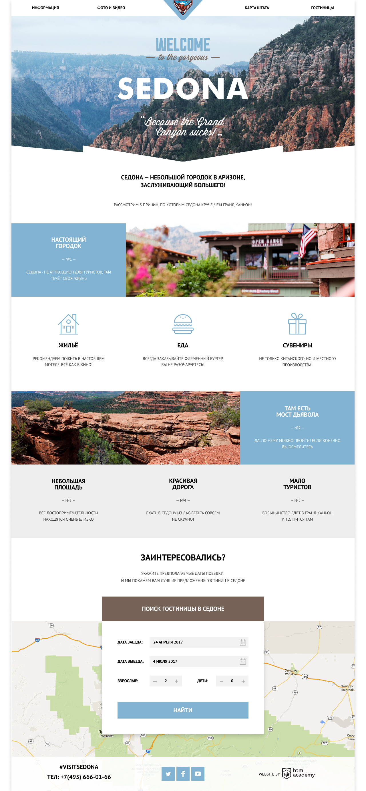
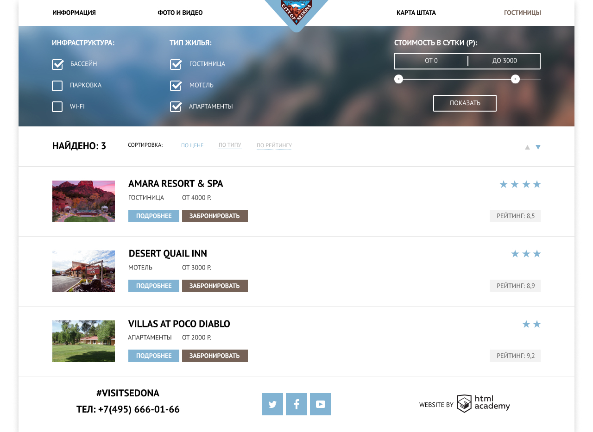

# Проект: Веб-сайт города Седона

## 📓 Описание проекта:

Веб-сайт города Седона - это мой второй проект в рамках обучения професии. Проект состоит из 2-х страниц фиксированной ширины.

- **Стандарты верстки:** HTML5, CSS3, прогрессивное улучшение.
- **Сетка:** определена в макете.
- **Адаптивность вёрстки:** нет.
- **Используемые фреймворки:** нет.
- **Кроссбраузерность:** Chrome, Firefox, Safari, Edge, Internet Explorer 11.
- **Типографика:** частично определена в макете (прочее — на усмотрение разработчика).
- **Используемые шрифты:** Cuprum, PT Sans (есть в папке с макетом и на Google Fonts).
- **Прочее:** С макетом предоставлен styleguide.psd, содержащий прорисовку состояний элементов интерфейса. При любых расхождениях с макетами он должен иметь наивысший приоритет.
---

## 🔖 Обязательные требования:

1. Контентная область центрируется и не может быть уже макетной ширины.
2. Логотип не является пунктом меню. Его нужно размечать отдельным элементом.
3. Главное меню: пункт «Информация» не является ссылкой на главную страницу.
4. Главное меню: четыре ячейки одинаковой ширины. Для первых двух пунктов выравнивание текста по левому краю, для двух последних — по правому.
5. Ссылки в главном меню: кликабельным должен быть только текст.
6. Слева и справа от контентной области должен быть серый фон, на который сайт бросает лёгкую тень.
7. В трёх блоках футера контент расположен по центру.
8. Логотип Академии в подвале ведёт на лендинг интенсива «HTML и CSS. Профессиональная вёрстка сайтов».

### Index:

9. Крупное фото: фотография занимает всю ширину, в её нижней части есть белая маска.
10. По умолчанию форма поиска гостиницы должна быть открыта.
11. Кнопка «Поиск гостиницы в Седоне» управляет отображением формы поиска гостиницы. Вёрстка блока с формой поиска гостиницы обязательна.
12. Иконка календаря в поле ввода даты должна быть добавлена отдельным элементом, чтобы в будущем на неё программист мог повесить событие нажатия для открытия календаря с возможностью выбора даты.
13. Блок карты: достаточная реализация — обычное изображение.

### Hotels:

14. Логотип — это ссылка на главную страницу.
15. Главное меню и футер совпадают с главной страницей.
16. Крупное фото: фотография занимает всю ширину, но отличается от главной страницы — она размыта и меньше по высоте.
17. Фильтр: верстать с помощью формы, кнопка «Показать» отвечает за отправку формы на адрес https://echo.htmlacademy.ru/.
18. Блок «Стоимость в сутки»: при взаимодействии с любым из маркеров в качестве указателя допускается использовать любой подходящий тип курсора. Делать маркеры интерактивными не обязательно, стоимость меняться не должна.

---

## 🔋 Дополнительные требования

### Index:

1. При инициализации JS на форму добавляется класс, который её скрывает.
2. Кнопка «Поиск гостиницы в Седоне» управляет отображением формы поиска гостиницы. Появление формы необходимо дополнить анимацией «выезда» сверху вниз относительно кнопки, а не окна браузера.
3. Блок карты: интерактивная карта, которая тянется на всю ширину контейнера. Реализация по желанию.

### Hotels:

4. Фильтр: клик по кнопке «Показать» отправляет форму.

---

## 🗺️ Макет:
### Главная страница:

      

### Страница отелей:

      

---

## 🧪 Опыт и сложности:

Проект по сложности 1 из 10. Но тем не менее я смог из него взять немало опыта. Это верстка меню фильтров, карточек отелей, выползающего меню, CSS анимация.
